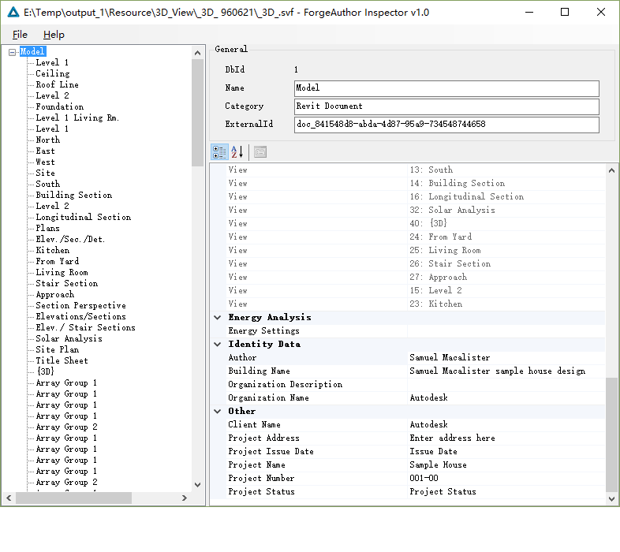
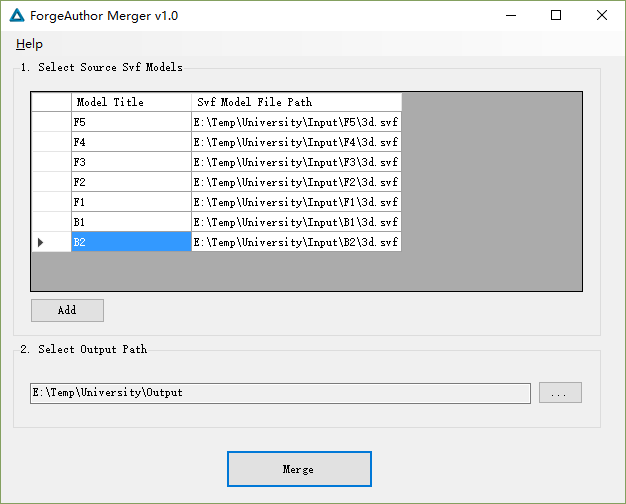
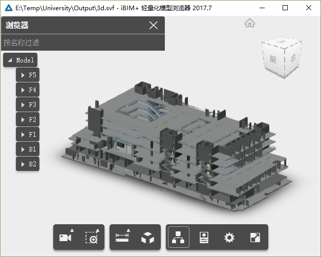
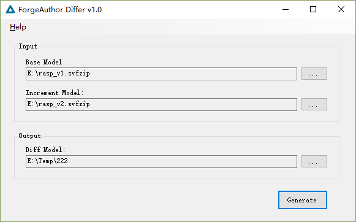
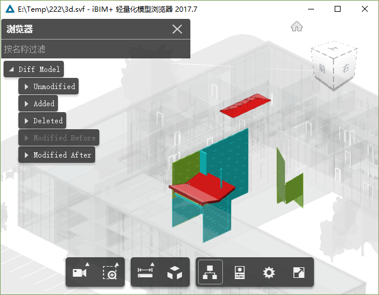

[简体中文版本点这里](README-CHS.md)

----

# forge-author-samples
Demonstrate how to use ForgeAuthor manipulate Autodesk Forge Svf model.

### Demo 1# - Inspector (ready)

[Binary Download (Update: October 23th, 2017)](https://pan.baidu.com/s/1gfxS5gB)

Inspector can read, display, modify, export and other operations on attribute data of Autodesk Forge Svf offline model.

 

### Demo 2# - Merger (ready)

[Binary Download (Update: October 23th, 2017)](https://pan.baidu.com/s/1cMzotw)

Merger can merge multiple Autodesk Forge Svf offline models to one.

 

 

### Demo 3# - Differ (ready)

[Binary Download (Update: October 23th, 2017)](https://pan.baidu.com/s/1kVehCd5)

Differ can compare different versions of the same model, recognize the difference component, generate the diff model, and use different colors to identify the components that are added, deleted, and modified.

>When you recommend browsing the difference model, turn off the "Ambient shadows" and "Ground shadow" feature to get the best visual effect

 

 

### more demos will coming soon ...

----

# What is ForgeAuthor?

ForgeAuthor is a .net library based on .net framework 4.5, it provides a nice object oriented way to manipulate the Audesk Forge Svf Model, as simple as manipulate XML or JSON.

ForgeAuthor contains two major components, SvfDatabase and SvfDocument。

The main difference between SvfDatabase and SvfDocument is that SvfDatabase only manipulates properties data, while SvfDocument can manipulate full data of the model.

# Is ForgeAuthor free?
ForgeAuthor is commercial software, but using SvfDatabase to read and export properties data is permanently and completely free.

ForgeAuthor provides a 30-day full-functional trial period, but the free functionality of the ForgeAuthor after the trial period is still available.

# How to purchase licenses?

Please contact liuyongsheng@msn.com or bimangle@aliyun.com

